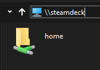

<h1 align="center">SteamDeck Samba Server</h1>

  <b>Execute one line code and share your SteamDeck with local network using smb protocol , allowing you to easily view and transfer SteamDeck files from or to your device.</b>
   
   
  
   Windows File Explorer

   

## Installation

To run the script, simply insert the following command in your SteamDeck terminal:

 
`sh -c "$(curl -fsSL https://raw.githubusercontent.com/Spec-DY/steamdeck-samba-server/newversion/script.sh)"`

This will automatically download and run the script.sh file from the GitHub repository, which will install and configure the Samba server on your SteamDeck.

This script allows sharing multiple directories based on your preferences. During the installation process, you will need to enter the path of the directory you intend to share, for example: `/home/deck/Applications/`. It will ask if you want to add more folders to share. Press `enter` without input and it will share the entire `/home/` directory for quick setup.

## Usage

Once the Samba server is installed, you can connect to it from any device on the same network. Simply open a file explorer window on your computer, and type the following in the address bar:

`\\steamdeck`

You should then be prompted to enter your SteamDeck username and password. Once you do so, you'll be able to access the files on your SteamDeck just like any other shared folder.

## Contributing

This project is open for criticism and contributions. Pull requests are accepted, and you can open [issues](https://github.com/malordin/steamdeck-samba-server/issues) in case of problems. If you like the project, you can show your support by putting a star.

Thank you for your interest in this project. I am always open to feedback and suggestions to improve the project.

## License

This script is licensed under the [MIT License](https://github.com/malordin/steamdeck-samba-server/blob/main/LICENSE). Feel free to use, modify, and distribute it as you see fit.

## Star History

<a href="https://star-history.com/#malordin/steamdeck-samba-server&Date">
  <picture>
    <source media="(prefers-color-scheme: dark)" srcset="https://api.star-history.com/svg?repos=malordin/steamdeck-samba-server&type=Date&theme=dark" />
    <source media="(prefers-color-scheme: light)" srcset="https://api.star-history.com/svg?repos=malordin/steamdeck-samba-server&type=Date" />
    
  </picture>
</a> 

